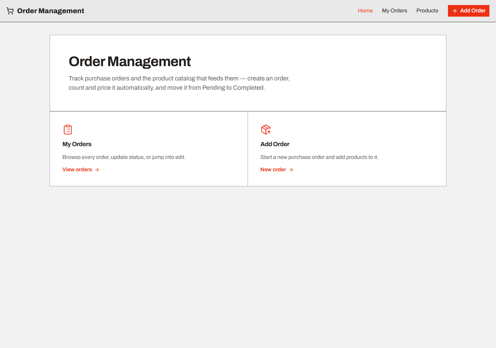

# Order Management

> Purchase order and product catalog management — full CRUD, status changes, and automatic total calculation.



---

## 🧩 Problem / Context

Built as a technical test for a job interview process: given a spec with two required views (order list and add/edit) plus extra points (product CRUD, status changes, blocking edits on completed orders), build the frontend consuming a custom API. It also doubled as practice for a real stack migration (JS → TS, npm → pnpm, Bootstrap → Tailwind/shadcn) on a project that was already up and running, not built from scratch.

---

## 🛠️ Stack

| Layer           | Technology       |
|-----------------|------------------|
| Frontend        | React 19 + TypeScript, Vite, Tailwind CSS v4, shadcn/ui (Radix UI), TanStack React Query, React Router, Axios, Sonner |
| Backend         | .NET 8 (C#), Clean Architecture (Api / Application / Domain / Infrastructure), FluentValidation, AutoMapper, Serilog |
| Database        | MySQL (Pomelo.EntityFrameworkCore.MySql) |
| Auth            | Not required — endpoints are public per the spec |
| Deploy / Infra  | Frontend: Netlify · Backend: Azure App Service |

---

## 🏗️ Architecture

- **Layered backend** (Domain / Application / Infrastructure / Api) with repositories + AutoMapper for entity-to-DTO mapping, and FluentValidation for input business rules.
- **Real pagination** on list endpoints (`PagedResult<T>` with `page`, `pageSize`, `totalCount`), consumed from the frontend without leaking pagination details to the rest of the app.
- **Typed service layer on the frontend** (`src/services/api.ts`) separating HTTP calls from the rest of the components, with React Query for server-state caching instead of manual `useState` + `useEffect`.
- **Custom design system** ("Modernist") applied as CSS tokens on top of shadcn/ui — a single accent color, zero border radius, Archivo typography — to avoid relying on the component library's generic default look.
- Backend unit tests with xUnit + Moq.

---

## 🧠 Technical challenges and decisions

- **Problem:** the backend added pagination to the list endpoints and the frontend kept treating the response as a plain array — it broke silently as soon as there was more than one page of data. **Solution:** unwrapping `.items` was centralized inside the service layer, so the rest of the app keeps receiving a plain array. **Why:** it keeps individual components from needing to know about pagination, and prevents the bug from resurfacing elsewhere.
- **Problem:** migrating from Bootstrap to Tailwind CSS v4 module by module, without being able to drop Bootstrap all at once because parts of the app still depended on it. Both frameworks define global resets that stepped on each other. **Solution:** Bootstrap was isolated into its own lower-priority layer using CSS Cascade Layers (`@layer bootstrap, theme, base, components, utilities`). **Why:** it allowed migrating one component at a time without visually breaking either the ones already migrated or the ones still pending.
- **Problem:** the repo had been saved with the entire project nested inside a subfolder, and the `.env` file with the production URL had been committed. **Solution:** the structure was flattened while preserving git history (`git mv`), the `.env` was untracked, and the project was migrated to pnpm + TypeScript incrementally (`allowJs`) without blocking ongoing development. **Why:** clean up the foundation before adding more functionality, instead of piling up debt on top of a broken structure.
- **Problem:** the spec required that the modal for editing a product already in an order only allow changing the quantity, not the product itself. **Solution:** the product `Select` is automatically disabled whenever the modal opens in edit mode. **Why:** it prevents a quantity edit from accidentally swapping out the line's product.

---

## 🚀 How to run it

Requires the [backend](https://github.com/Carlou134/OrderManagementBackend) running alongside it (MySQL + .NET 8).

```bash
git clone https://github.com/Carlou134/OrderManagementFrontEnd.git
cd OrderManagementFrontEnd
pnpm install
cp .env.example .env.development   # point VITE_API_URL to your local backend
pnpm dev
```

---

## 🔗 Related links

- Backend: [github.com/Carlou134/OrderManagementBackend](https://github.com/Carlou134/OrderManagementBackend)

- Frontend: [github.com/Carlou134/OrderManagementFrontEnd](https://github.com/Carlou134/OrderManagementFrontEnd)
